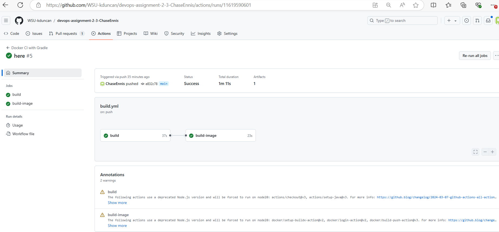
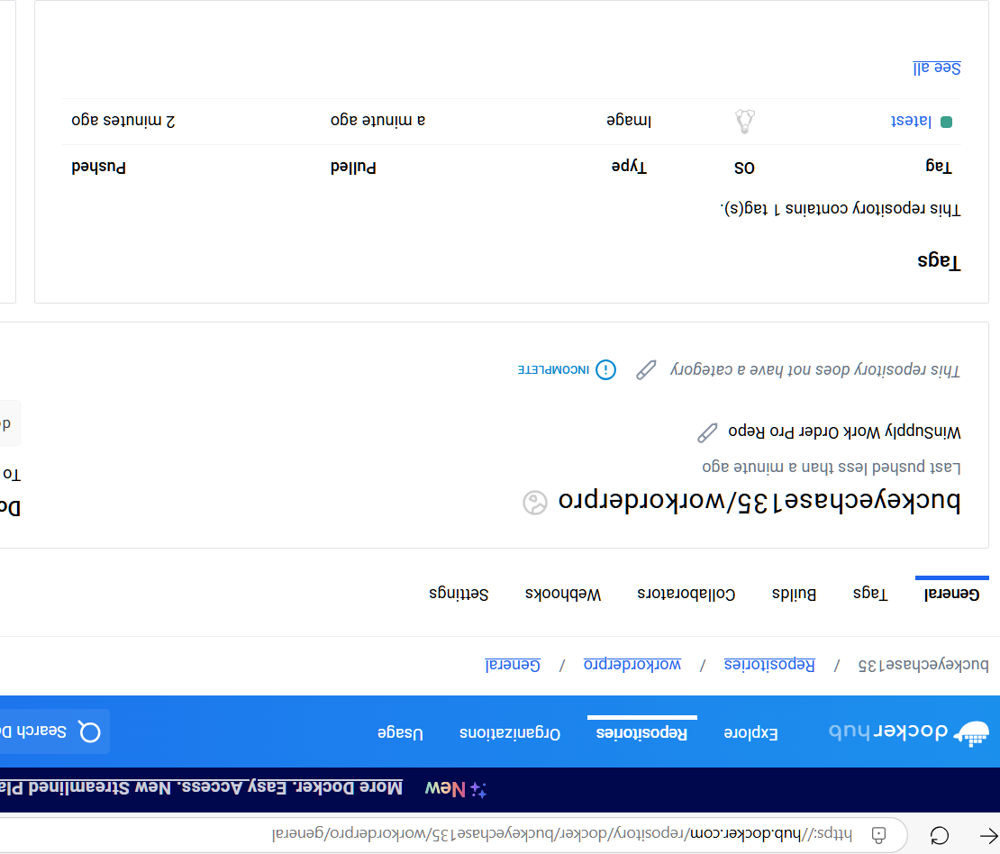

# DevOps Assigment 2 - GitHub Actions & DockerHub

## Description of Workflow

## Link to DockerHub Repository
[DockerHub - `Ennis-WOPro-Service`](https://hub.docker.com/repository/docker/buckeyechase135/workorderpro/general)

## Link to GitHub Actions Run Results Summary
[Link to **working** workflow run results](https://github.com/WSU-kduncan/devops-assignment-2-3-ChaseEnnis/actions/runs/11619590601)
